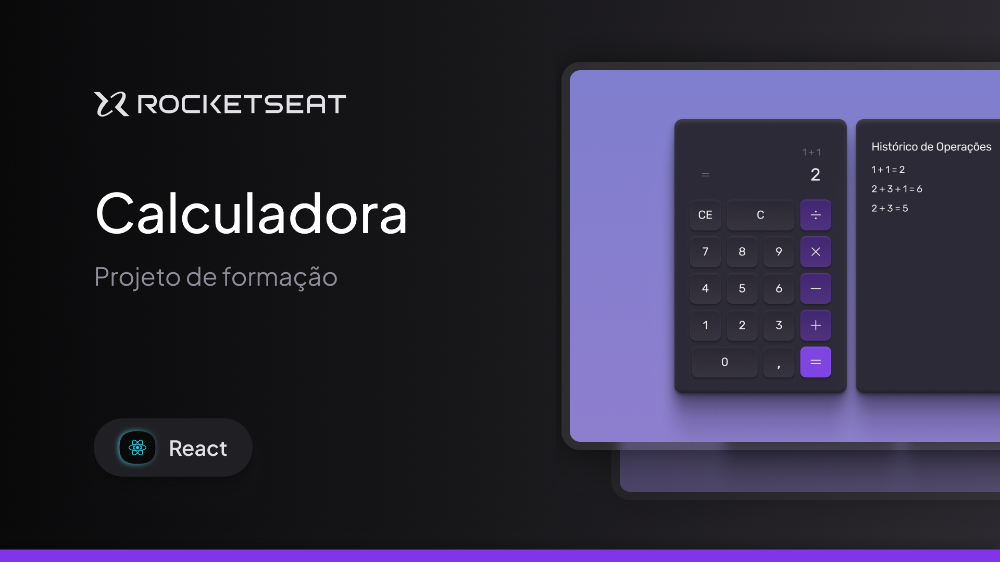

<h1 align="center"> Calculadora </h1>

Nesse repositório foi desenvolvido um projeto de uma calculadora funcional para praticar os fundamentos do React JS durante a formação React da Rocketseat.  

  <a href="#-tecnologias">Tecnologias</a>&nbsp;&nbsp;&nbsp;|&nbsp;&nbsp;&nbsp;
  <a href="#-topicos">Tópicos</a>&nbsp;&nbsp;&nbsp;|&nbsp;&nbsp;&nbsp;
  <a href="#-projeto">Projeto</a>&nbsp;&nbsp;&nbsp;|&nbsp;&nbsp;&nbsp;
  <a href="#-layout">Layout</a>&nbsp;&nbsp;&nbsp;|&nbsp;&nbsp;&nbsp;
  <a href="#memo-licença">Licença</a>

  

 

  

## 🚀 Tecnologias

Esse projeto foi desenvolvido com as seguintes tecnologias:

- React JS
- Tailwind CSS
- Git e Github
- Figma

## ✅ Tópicos Abordados

Principais tópicos abordados durante o curso:

- Componentes
- Propriedades
- Eventos
- React Hooks: Estados
- Renderização condicional e de listas
- React Hooks: API de Contexto
- React Hooks: Efeitos
- Hooks Customizados

## 💻 Projeto

Calculadora funcional com histórico dos calculos.

- [Visite o projeto online](https://devayresrouxj.github.io/rocketseat-react-calculadora)

## 🔖 Layout

Você pode visualizar o layout do projeto através [DESSE LINK](https://www.figma.com/community/file/1502290022613146600/calculadora). É necessário ter conta no [Figma](https://figma.com) para acessá-lo.

## :memo: Licença

Esse projeto está sob a licença MIT.

---

Feito com ♥ by Ayres Roux :wave: [Vamos conversar!](https://ayresroux.com.br/)
